# Instalasi dan konfigurasi Ansible di CentOS7
Ansible adalah automation engine yang dijalankan untuk memudahkan untuk mengelola 
server yang berjumlah banyak.
>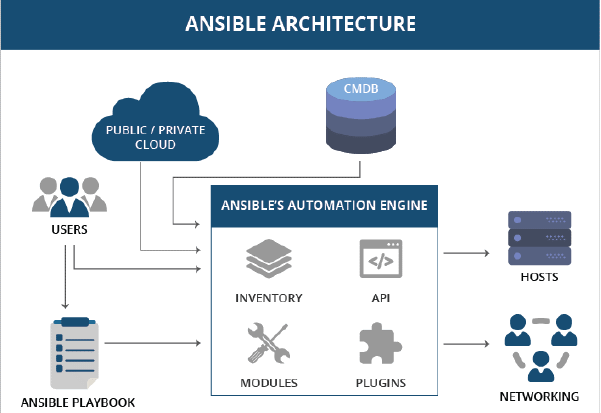

## Persiapan 
Kita harus mempunyai minimal  2  host  atau  2  server,  1  berperan  untuk  menjalankan 
ansible-nya, 1 sebagai target server/host yang akan dijalankan. 
Pada Module ini saya membuat 2 server centos yaitu: 

1. Centos_ansible_server = 192.168.93.30 
2. Centos_ansible_host = 192.168.93.183 

## Install ansible
Untuk menginstall ansible kita perlu menambahkan repositori Epel kedalam CentOS7 kita, menggunakan perintah berikut: 
```
# yum install epel-release
# yum update
```
Setelah paket repositori nya sudah update kita install ansible nya menggunakan perintah berikut: 
```
# yum install ansible
```
Selanjutanya tambahkan user baru untuk ansible-server
```
# useradd adminansible
# passwd adminansible
```

kemudian buat user baru untuk ansible-host **(IP:192.168.93.183)**

Pada setiap user di masing masing server tambahkan ke grub wheel agar bisa menjadi sudoer
```
usermod -a -G wheel adminansible
usermod -a -G wheel useransible
```

Selanjutnya kita ganti hostname dari setiap server. serveransible untuk server dan hostansible untuk host atau user
> 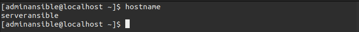
>
> 

Lalu tambahkan hostaname dan IP Address untuk file /etc/hosts pada server ansible dan host ansible
> **Alamat ip pada serveransible**
> 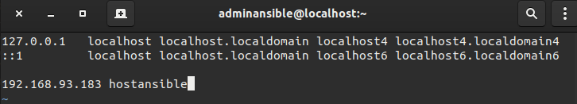
>
> **Alamat ip pada hostansible**
> 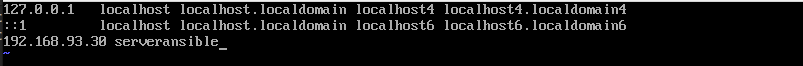

Lalu kita generate key ssh untuk server ansible
> 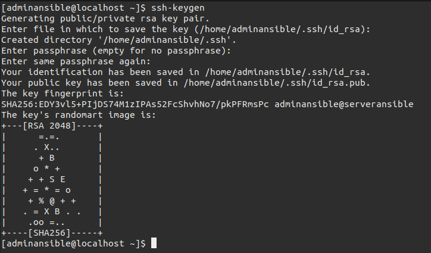

Selanjutnya kita copy dari server ke host menggunakan perintah
```
ssh-copy-id useransible@alamat_ip host
```
> 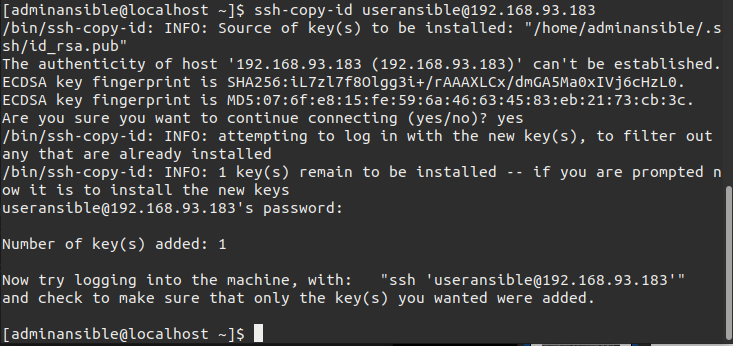

Coba kita remote host ansible, maka kita bisa terkoneksi tanpa dimintai password
> 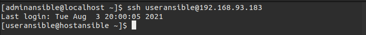

Tambahkan juga hostname dan ip dari server ke host dan juga sebaliknya seperti berikut:
> **alamat ip tambahan untuk hostansible**
> 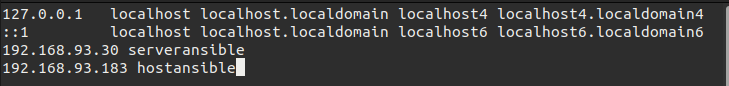
>
> **alamat ip tambahan untuk serveransible**
> 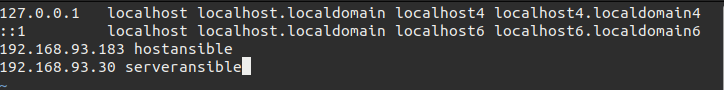

Lalu konfigurasi file host di `/etc/ansible/hosts` dengan menambahkan
```
hostansible
```
Pada host server buat user baru dengan nama adminasible. lalu `ssh-copy-id` di ansible server. 

Selanjutanya cek koneksi ansible dengan perintah 
```
# ansible all -m ping
```
> 


# Install LAMP on CentOS7
LAMP adalah singkatan dari Linux, Apache, MySQL/MariaDB, dan PHP.

### Berikut langkah langkah instalasi LAMP
Yang pertama install Apache web server.
```
# yum install httpd
```
Lalu kita coba jalankan servis apache
```
# systemctl start httpd
```


Install MariaDB
Kita akan menggunakan mariadb untuk database kita. 
```
# yum install mariadb-server mariadb
```

lalu aktifkan servis mariadb
```
# systemctl start mariadb
# systemctl enable mariadb
```
lalu kita konfigurasi mysql-nya. pertama jalankan perintah ini
```
mysql_secure_installation
```
Lalu kita akan disuruh menginput password untuk root user. Karena kita belum mengkonfigurasinya, tekan saja enter.
> 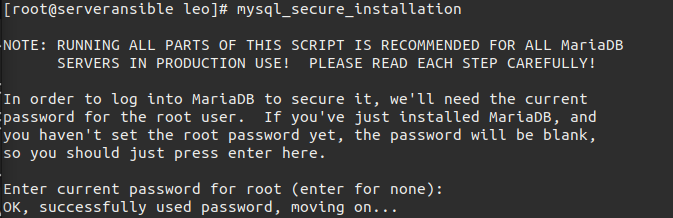

setelah itu kita akan ditanyakan untuk set password root. maka ketikkan y lalu enter, lalu ketikkan password root.
> 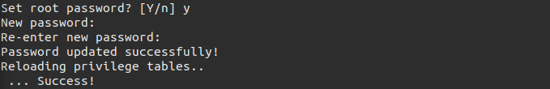

Lalu ketikkan y lagi untuk menghapus anonymous user

> 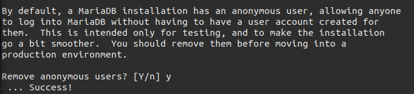

agar saat kita login sebagai root hanya bisa diakses melalu localhost ketikkan y .

> 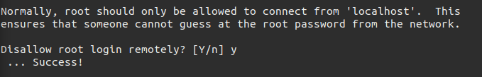

Lalu ketikkan lagi y untuk menghapus test database

> 

Terakhi ketikkan y untuk mereload privileges dan menjalankan konfigurasi tadi

> 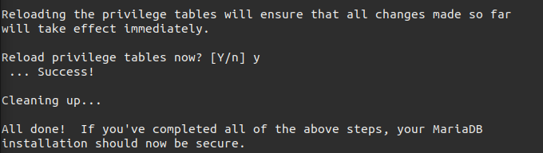
Konfigurasi yang tadi kita lakukan berjalan dengan baik

> 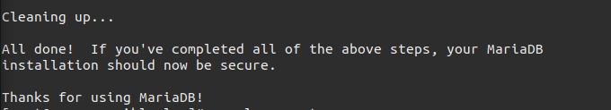
Untuk login ke mysql bisa gunakan perintah berikut
```
mysql -u root -p
```
> 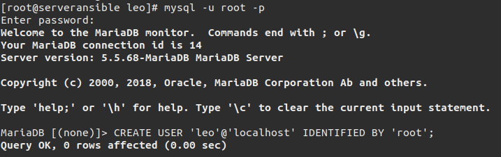

kita juga bisa menambahkan user baru. jalankan script

CREATE USER 'user'@'host' IDENTIFIED BY 'password';

> 

Dari statement dia atas kita akan membuat sebuah user baru dengan nama user01 di localhost, dengan password yang tertera pada gambar.

Lalu kita akan memberikan privileges untuk user yang baru saja kita buat

GRANT ALL PRIVILEGES ON database_name TO 'user'@'host';

> 

- GRANT ALL PRIVILEGES untuk membuat user dapat menjalankan semua priviliges.

- ON *.* Untuk menset database yang dapat dijamah atau diset oleh user. tanda *.* untuk menyatakan semua tabel.

- TO Untuk menspesifikkan user.

untuk menyinpan konfigurasi dan membersihkan memori dari cache ketikkan
```
FLUSH PRIVILEGES;
```
Untuk keluar ketikkan

exit;

Mari kita test login ke user yang barusan kita buat.

> 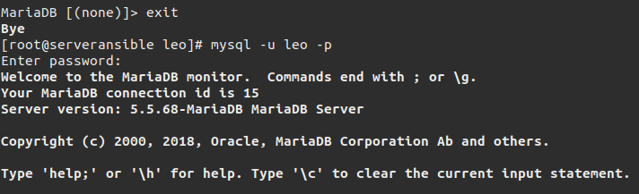


Disini kita akan install php untuk bagian aplikasi. Telebih dahulu kita tambahkan repo IUS dengan menjalankan perintah
```
yum install \
https://repo.ius.io/ius-release-el7.rpm \
https://dl.fedoraproject.org/pub/epel/epel-release-latest-7.noarch.rpm
```
Lalu install php
```
# yum install php73-common php73-fpm php73-mysqlnd
```
lalu jalankan servis php
```
# systemctl start php-fpm
# systemctl enable php-fpm
```
Install Word Press
```
# cd /var/www/html
```
Jika sudah masuk direktori html, masukkan perintah di bawah ini untuk memulai proses download WordPress:
```
# wget http://wordpress.org/latest.zip
```
Apabila proses download sudah selesai, lakukan proses ekstrak file latest.zip  untuk membuat struktur direktori WordPress:
```
# unzip latest.zip
```
